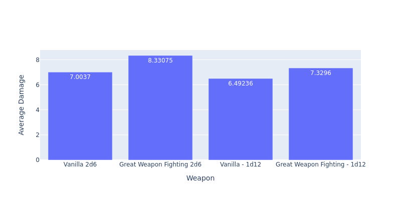

# greatsword vs greataxe

This directory contains two simulations:
* great_weapon_fighting
    * Two characters using the Great Weapon Fighting feature (reroll 1s on damage dice) are compared based on their average damage
* great_weapon_fighting_brutal_critical
    * Two characters using the Great Weapon Fighting feature _and_ the Barbarian class feature Brutal Critical (reroll one damage die on a critical hit) are compared based on their average damage

## Results

