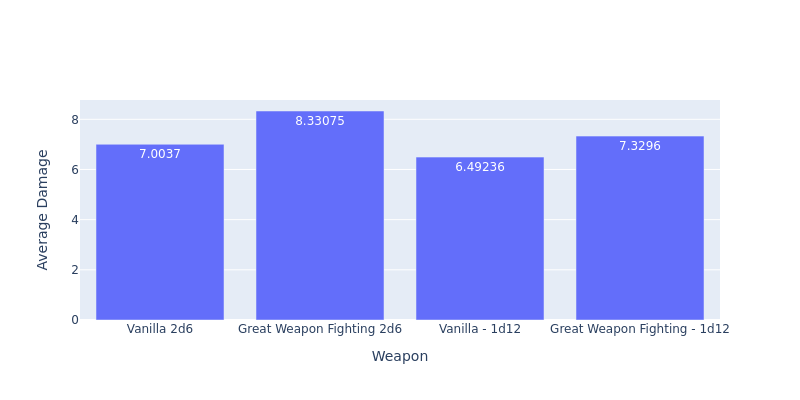
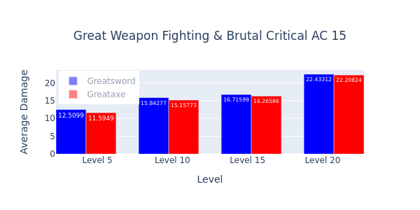
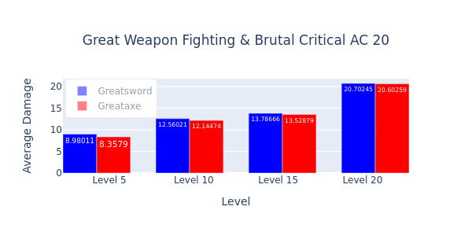
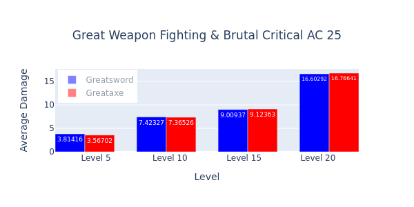

# shield vs two hand

This directory contains one simulation:
* sheild_battle
    * Two characters fight each other and the same randomly generated monster of appropriate Challenge Rating, until one's hit points are reduced to 0. One character uses a longsword and shield, while the other uses a longsword with two hands

## Results

## Interpretation

With just the Great Weapon Fighting feature, the Great Sword clearly performs better than the Great Axe, and, unsurprisingly, benefits more from the feature.

Despite the surface-level attractiveness of using a greataxe with Brutal Critical, the Great Sword ultimately performs better across levels and opposing Armor Classes, except against exceptionally high ACs, where the difference between each weapon is negligible.